bambu-auto-pause
===

## What is this?

Bambulab 3d printer support multi-color prints by using an AMS
to automatically switch between filaments. Each AMS can hold
up to four colors. Printing with more than four colors would require
another AMS or in the case of an AMS Lite, it would not be supported
at all.

There is a way to print with more than four colors and one AMS unit,
by mapping multiple colors to the same AMS slot and swapping
the filament in the AMS while it is printing. This requires careful
planning and one must take care to not miss the time where the
filament has to be manually swapped.

To alleviate this problem, one can insert pauses in the slicer
at desired layers. The printer will then stop before it starts
printing that layer.

For example in this print

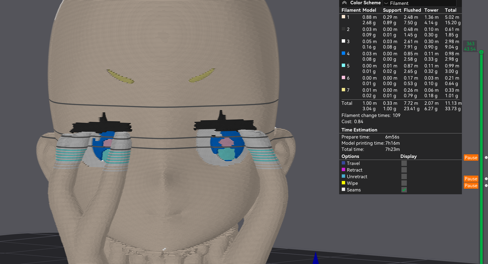

the pauses are indicated by the gray lines in the model.
For this model at most 4 colors are used in one layer, which is why
this works.

The process is described in
[this makerworld model](https://makerworld.com/en/models/414476#profileId-316437).

For other models, where more than 4 colors are used in the same layer,
this will not work. As far as I know, there is nothing in bambu studio
to set pauses before a filament change in the same layer.
One could still print these models by carefully watching the printer
and swapping out the colors before they are used without pausing,
but this will likely lead to messed up colors (if one accidentally
inserts the wrong color or forgets to change it).

And this is what this script is for. It will automatically add
pauses when necessary, and even works with more than four colors on
the same layer, so you do not have to watch the printer all
the time.

## How to use?

This project is written in python, and must be installed on your computer. I recommend installing at least Python 3.12.7 (higher numbers are okay too).
You can [download it here](https://www.python.org/downloads/).

To verify that everything is working, you can open a terminal
and type in the following command (without the `$`):
```shell
$ python --version
Python 3.12.7
```
Make sure that it shows you a version and not something like "unknown command python".

After this, you have to download the script. On the website click the
green "Code" button, then the "download zip" button. Extract the zip
file into a folder, doesn't matter where the folder is.

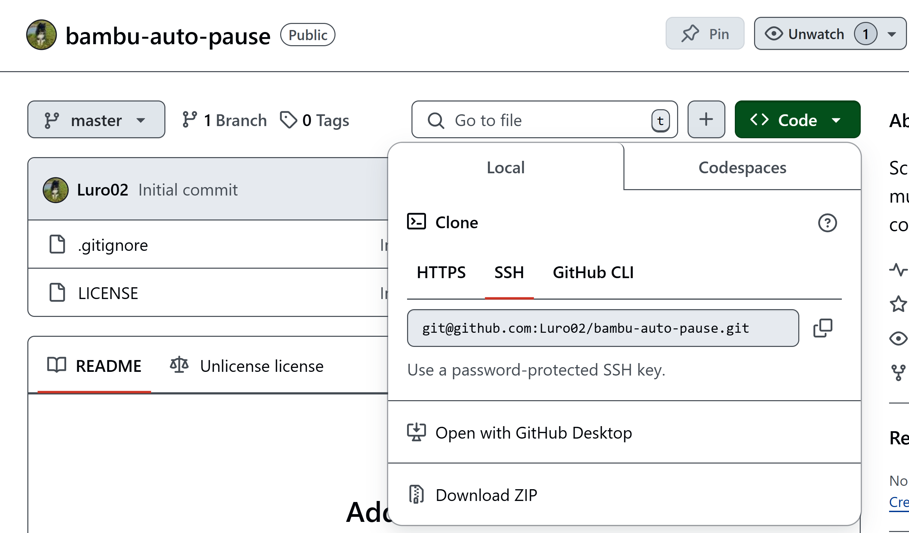

The next step is to open a terminal and navigate to the folder where
the previously downloaded files are:
```
PS C:\Users\Lucas> cd C:\Users\Lucas\Desktop\bambu-auto-pause
PS C:\Users\Lucas\Desktop\bambu-auto-pause>
```
In my case, I have the folder on the desktop.

### Exporting the gcode in Bambu Studio

You can paint your model with more than four colors, like this:

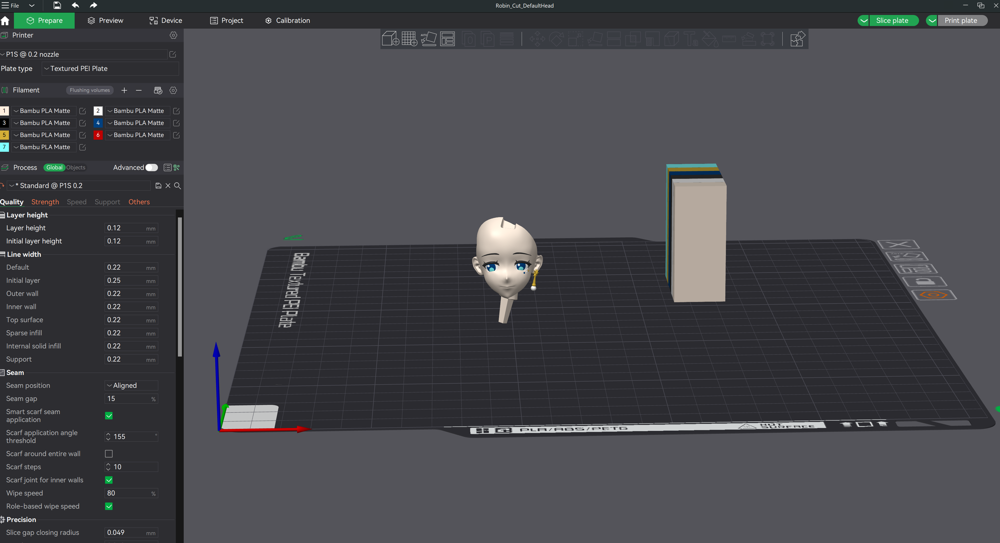

When are finished with painting, selected the correct filament
profiles, settings and are ready to print, press the slice plate button:
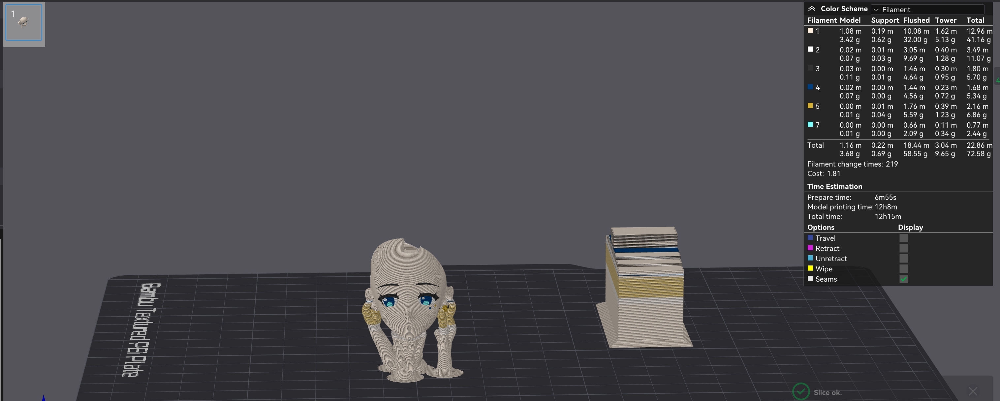

On the right you can see that is using 6 colors for the model
(the red is not used, which is why it is missing).

Instead of sending the model to print, you have to select the export
plate sliced file by pressing on the down arrow
(to the left of the print plate button):

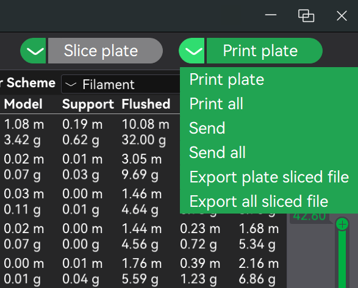

Then click on the export plate sliced file button:
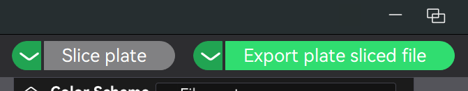

and select a location where you want to save the file to.
I recommend choosing the location where previously downloaded
files are in, it should look something like this:

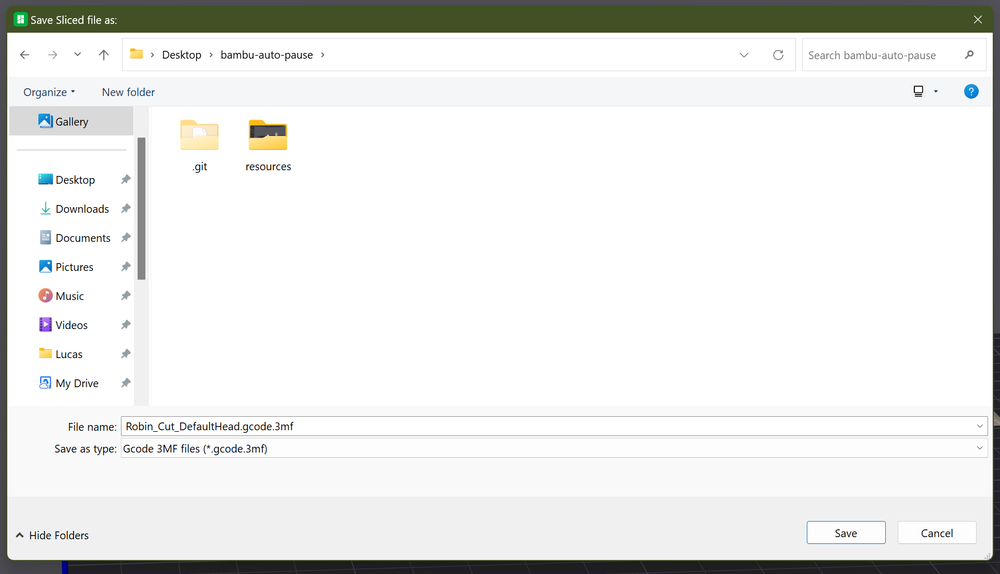

### Deciding which colors should share a slot:

This script can not change reality, so you will still have space for 
only four filaments in the AMS. Therefore you have to decide which 
filaments should share a slot in the AMS. You will later have to 
manually swap these filaments.

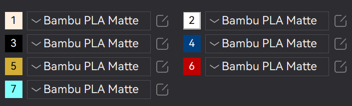

Theoretically you could choose at random, but this might result in you
having to do a lot of manual filament changes (like 80 vs 26).

What you choose depends on the model, which is why I will explain this
with my example model:

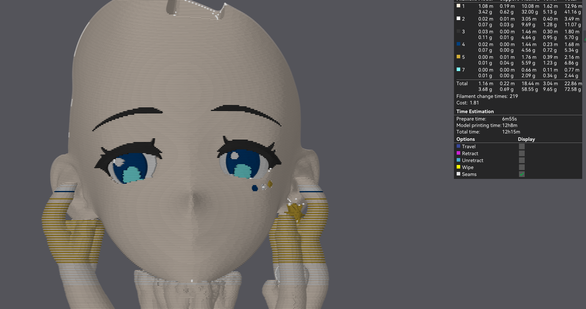

The most used colors are
- skin color (3.42g)
- black (0.11g)
- white (0.07g)
- dark blue (0.07g)

Based on that I would not swap out the skin color. The bright blue is
only used for a small part of the eye, so I would make that color share
a slot with another color.

Black only starts around the middle of the bright blue, so one could
make the two colors share a slot.

The other color that I would swap is yellow, because there is not that 
much of it in the model.
I would swap it with either dark blue or white (both are used less than 
the skin color). One could technically make three colors share one slot
(yellow, bright blue, black), but that would be confusing.
I prefer to only have two colors share one slot.

To summarize, for my model the AMS slots would be used like this:
1. skin color
2. white and yellow
3. black and bright blue
4. dark blue

### Preparing the file for printing

Execute the script and tell it which colors share a slot:
```
$ python bambu_auto_pause.py Robin_Cut_DefaultHead.gcode.3mf 7:3 5:2
```
Note that you have to change the latter numbers based on which colors
you chose to share a slot. I chose black (color number 3) and bright
blue (color number 7) to share a slot, so I added a `7:3` to the script
(blue should be where black is). I did the same for white
(color number 2) and yellow (color number 5) = `5:2`.

After executing the script, you will get an output that looks like this:
```
$ python bambu_auto_pause.py Robin_Cut_DefaultHead.gcode.3mf 7:3 5:2
Manual filament change required in layer 126: Swap color 2 with 5: [1, 2, 3, 4]
Manual filament change required in layer 187: Swap color 5 with 2: [1, 5, 3, 4]
Manual filament change required in layer 189: Swap color 2 with 5: [1, 2, 3, 4]
Manual filament change required in layer 190: Swap color 5 with 2: [1, 5, 3, 4]
Manual filament change required in layer 191: Swap color 2 with 5: [1, 2, 3, 4]
Manual filament change required in layer 192: Swap color 5 with 2: [1, 5, 3, 4]
Manual filament change required in layer 193: Swap color 2 with 5: [1, 2, 3, 4]
Manual filament change required in layer 193: Swap color 5 with 2: [1, 5, 3, 4]
Manual filament change required in layer 193: Swap color 3 with 7: [1, 2, 3, 4]
Manual filament change required in layer 194: Swap color 2 with 5: [1, 2, 7, 4]
Manual filament change required in layer 194: Swap color 5 with 2: [1, 5, 7, 4]
Manual filament change required in layer 198: Swap color 7 with 3: [1, 2, 7, 4]
Manual filament change required in layer 198: Swap color 3 with 7: [1, 2, 3, 4]
Manual filament change required in layer 199: Swap color 7 with 3: [1, 2, 7, 4]
Manual filament change required in layer 199: Swap color 3 with 7: [1, 2, 3, 4]
Manual filament change required in layer 200: Swap color 7 with 3: [1, 2, 7, 4]
Manual filament change required in layer 200: Swap color 3 with 7: [1, 2, 3, 4]
Manual filament change required in layer 201: Swap color 7 with 3: [1, 2, 7, 4]
Manual filament change required in layer 202: Swap color 3 with 7: [1, 2, 3, 4]
Manual filament change required in layer 203: Swap color 7 with 3: [1, 2, 7, 4]
Manual filament change required in layer 203: Swap color 3 with 7: [1, 2, 3, 4]
Manual filament change required in layer 204: Swap color 7 with 3: [1, 2, 7, 4]
Manual filament change required in layer 205: Swap color 3 with 7: [1, 2, 3, 4]
Manual filament change required in layer 206: Swap color 7 with 3: [1, 2, 7, 4]
Manual filament change required in layer 206: Swap color 3 with 7: [1, 2, 3, 4]
Manual filament change required in layer 207: Swap color 7 with 3: [1, 2, 7, 4]

Filament change times: 219
Manual filament change times: 26

The print order has to be changed in the slicer, so that the following colors are not printed after each other:
Layer 126 to 126: ['2 -> 5']
Layer 193 to 194: ['5 -> 2']
Traceback (most recent call last):
  File "C:\Users\Lucas\Desktop\bambu-auto-pause\bambu_auto_pause.py", line 279, in <module>
    new_gcode = insert_necessary_pauses(read_gcode_file(input_file), remap)
                ^^^^^^^^^^^^^^^^^^^^^^^^^^^^^^^^^^^^^^^^^^^^^^^^^^^^^^^^^^^
  File "C:\Users\Lucas\Desktop\bambu-auto-pause\bambu_auto_pause.py", line 247, in insert_necessary_pauses
    raise ValueError("Please fix the filament change order in the slicer.")
ValueError: Please fix the filament change order in the slicer.
```
The script will list what filament changes are required and which color numbers you have to swap with which one in the AMS.
**Note the end of the output, where it mentions that you must change the printing order in the slicer.**

My output says that on layer 126 it will print with the color 2 (which is white) and then the slicer wants to swap to the
color 5 (which is yellow). The problem is that white and yellow share the same slot in the AMS and you can not swap out white
with yellow when the printer is currently printing with white. That 
might be solved in the future, but for now you have to do some
manual work.

In Bambu Studio you can define in what order the colors are printed,
to do this go to "Objects"
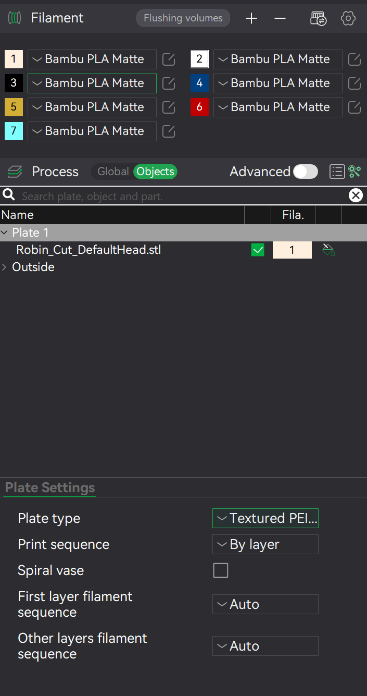

Then click on the "Other layers filament sequence" and change it from "Auto" to "Customize":

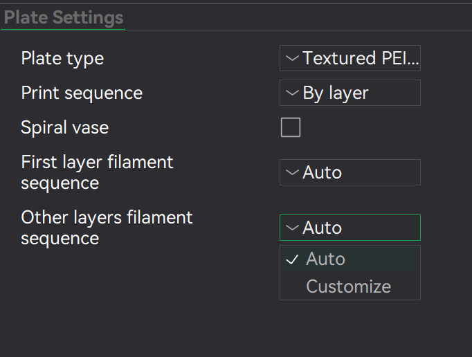

This will open a window that looks like this, here you can press on the + to add a custom sequence ranging from start to end layer.
The script mentions which layer ranges have to be changed.

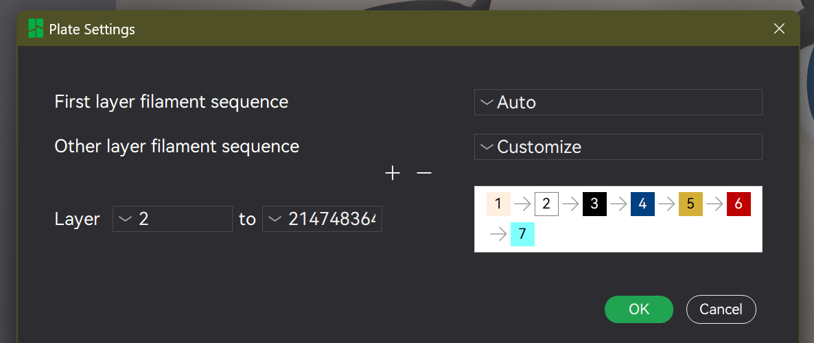

For the example file, it mentioned two layer ranges:

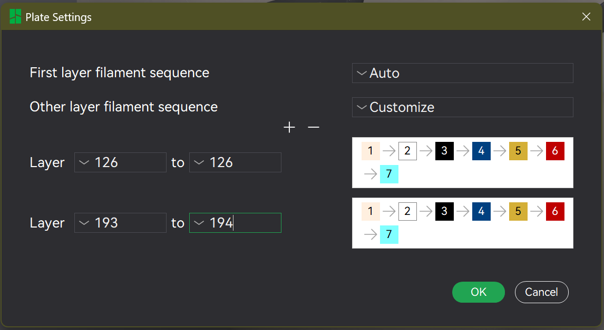

On the right you see in which order the colors are printed.
By default it will print them in the order they are numbered.
Remember that the script mentioned that color 2 must not be printed
after color 5? As you can see, it will print colors 3 (black) and 4 (dark blue) before color 5, so why is it complaining?

On that layer there is no black or dark blue, which is why it will skip these and directly print yellow.

The solution is quite simple, just make it print a different color between the two like this:

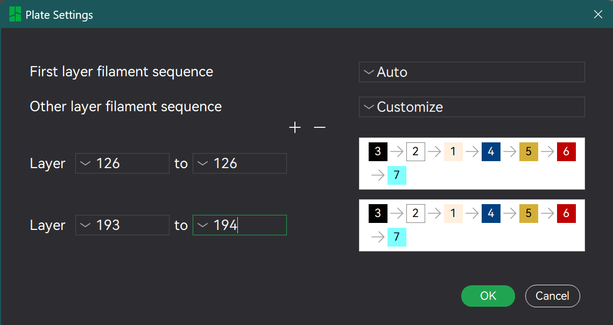

Then press "Ok", Slice the file again and overwrite the `.gcode.3mf`
file, like described in the "Exporting the gcode in Bambu Studio"
section.

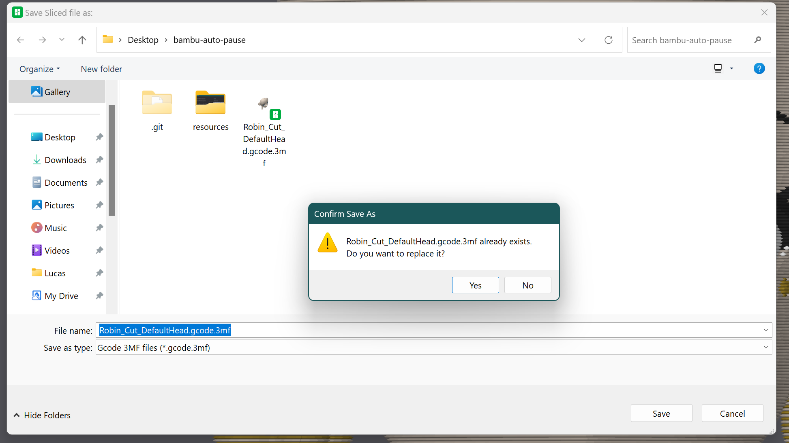

After that, execute the same command that you executed above.
If you are lucky it will not complain about another conflict,
or you might have to edit the print order again.

In my case there were no errors:
```
$ python bambu_auto_pause.py Robin_Cut_DefaultHead.gcode.3mf 7:3 5:2
Manual filament change required in layer 126: Swap color 2 with 5: [1, 2, 3, 4]
Manual filament change required in layer 187: Swap color 5 with 2: [1, 5, 3, 4]
Manual filament change required in layer 189: Swap color 2 with 5: [1, 2, 3, 4]
Manual filament change required in layer 190: Swap color 5 with 2: [1, 5, 3, 4]
Manual filament change required in layer 191: Swap color 2 with 5: [1, 2, 3, 4]
Manual filament change required in layer 192: Swap color 5 with 2: [1, 5, 3, 4]
Manual filament change required in layer 193: Swap color 2 with 5: [1, 2, 3, 4]
Manual filament change required in layer 193: Swap color 3 with 7: [1, 5, 3, 4]
Manual filament change required in layer 194: Swap color 5 with 2: [1, 5, 7, 4]
Manual filament change required in layer 194: Swap color 2 with 5: [1, 2, 7, 4]
Manual filament change required in layer 195: Swap color 5 with 2: [1, 5, 7, 4]
Manual filament change required in layer 198: Swap color 7 with 3: [1, 2, 7, 4]
Manual filament change required in layer 198: Swap color 3 with 7: [1, 2, 3, 4]
Manual filament change required in layer 199: Swap color 7 with 3: [1, 2, 7, 4]
Manual filament change required in layer 200: Swap color 3 with 7: [1, 2, 3, 4]
Manual filament change required in layer 201: Swap color 7 with 3: [1, 2, 7, 4]
Manual filament change required in layer 201: Swap color 3 with 7: [1, 2, 3, 4]
Manual filament change required in layer 202: Swap color 7 with 3: [1, 2, 7, 4]
Manual filament change required in layer 203: Swap color 3 with 7: [1, 2, 3, 4]
Manual filament change required in layer 204: Swap color 7 with 3: [1, 2, 7, 4]
Manual filament change required in layer 204: Swap color 3 with 7: [1, 2, 3, 4]
Manual filament change required in layer 205: Swap color 7 with 3: [1, 2, 7, 4]
Manual filament change required in layer 206: Swap color 3 with 7: [1, 2, 3, 4]
Manual filament change required in layer 207: Swap color 7 with 3: [1, 2, 7, 4]
Manual filament change required in layer 207: Swap color 3 with 7: [1, 2, 3, 4]
Manual filament change required in layer 208: Swap color 7 with 3: [1, 2, 7, 4]

Filament change times: 217
Manual filament change times: 26
```

When it executes successfully, it will generate two new files in the folder, the `.gcode.3mf` file is in:
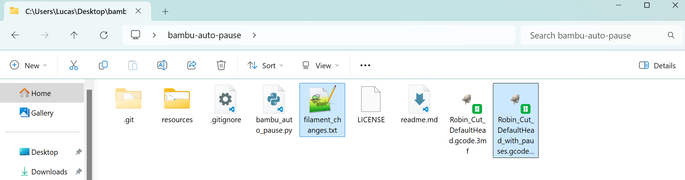

The `.txt` contains the same output that you got through the command line, describing when you have to change
which to colors. I recommend that you mark each line or delete it while you are going through the manual filament changes, so you do not swap the wrong colors.

The other file will have almost the same name as the original `.gcode.3mf`, it will have an `_with_pauses` in its name.
Make sure that you open that file and **NOT** the original file:

Check again that you opened the correct file. At the top middle of the window Bambu Studio will show the filename:

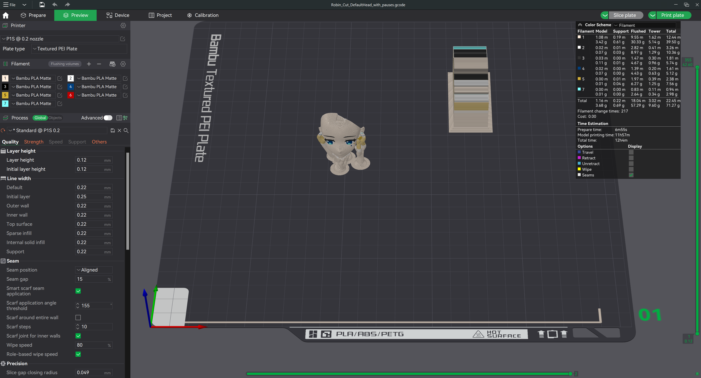

After that you can press the "Print Plate" Button and the following window will open up:

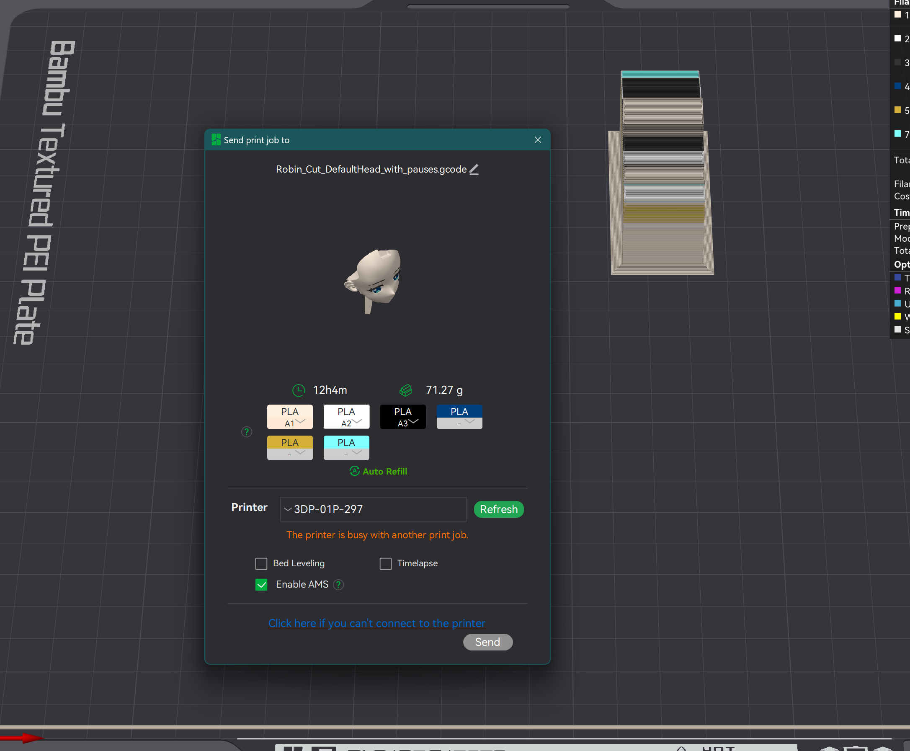

It is important that you map the right colors to the right slot. That is why I would recommend inserting the
colors in the order they numbered in bambu studio. For my example, I would insert them like this:
- Skin color in 1st slot
- White in 2nd slot
- Black in 3rd slot
- Dark Blue in 4th slot

The slots are numbered from left to right, with left being the first
slot. I do not know how that is with the AMS lite. In Bambu Studio it
will show the colors and which slots they are in (in the Device Tab).
(A1 = 1, A2 = 2, ...)

Now for the extra colors, you have to map them to the slots you decided above. For my example this was 
1. skin color
2. white and yellow
3. black and bright blue
4. dark blue

and that is exactly how you select it in the pop-up:

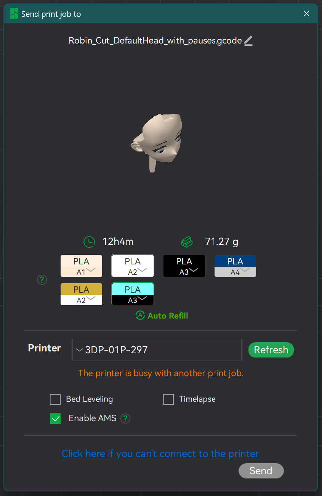

After you made sure that you selected everything correctly, you can send it to print.
The printer will automatically pause when a manual filament change is required.

If you want to change settings or slice the file again, you must not change the opened `.gcode.3mf`.
Close that file and open the original file that you used to export the `.gcode.3mf` and change that file. After that you
have to overwrite the `.gcode.3mf` and run the script again. After slicing the file, it might destroy
the printing order or remove the pauses, which is why you **must** execute the script again.
